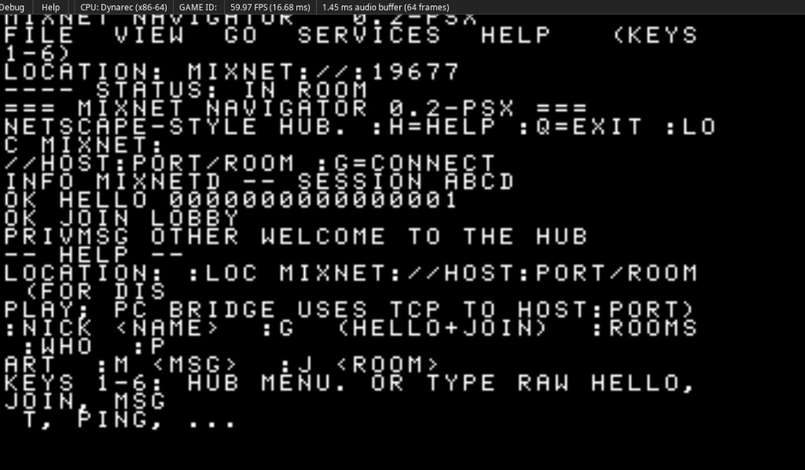

# PlayStation 1 (PSX) — Mixnet Navigator (“Netscape” hub)

This folder is the **PlayStation 1** slice of the project (see [../../README.md](../../README.md)): a **self-contained, PSYQ-friendly** C module you can **compile and run in an emulator** to prove the same **line protocol** as the PC server, before you wire a serial/pad **bridge** to a host PC.

A **text-mode “browser” shell** for **mixnetd**: title bar, **Location** bar (`mixnet://host:port/room` — logical address for your PC bridge; the PS1 does not run raw TCP in this source tree), **menu** keys [1]–[6], services (**ROOMS**, **WHO**, **PART**), and a **scroll** area for `INFO` / `PRIVMSG` lines — same line protocol as [`../../server/`](../../server) (default port in [`include/mixnet_config.h`](../include/mixnet_config.h)).

**Running in an emulator (PSYQ + `Fnt` text layer):** the stub draws the live navigator view for several seconds. Example: PCSX-Redux with `out\mixnet.cpe` or a packed PS-EXE/ISO (see [BUILD-PS1.md](BUILD-PS1.md)):



## Source files

| File | Role |
| --- | --- |
| [`mixnet_navigator.c`](mixnet_navigator.c) | Hub / UI state, URL parser, `mixnet_nav_*` API |
| [`mixnet_navigator.h`](mixnet_navigator.h) | Public include |
| [`mixnet_stub.c`](mixnet_stub.c) | `main`, byte TX buffer, [optional] `mixnet_psx_*` display stubs |
| [`mixnet_psx.h`](mixnet_psx.h) | Hooks for your **FntPrint** / GPU text layer |
| [`../common/mixnet_line.c`](../common/mixnet_line.c) | Line framing over the **bridge** (included from `main` T.U.) |
| [`build-psyq.bat`](build-psyq.bat) + [`write_ccpsx_sn.ps1`](write_ccpsx_sn.ps1) | **Windows + official PSYQ (CCPSX)**: one-shot build; see [BUILD-PS1.md](BUILD-PS1.md) |

### Official build (PSYQ on Windows)

End-to-end steps (junction **`C:\Psyq`**, `SN_PATH` / `ccpsx` link line, `out\mixnet.cpe`) are in **[BUILD-PS1.md](BUILD-PS1.md)**. From `clients\psx\`:

```bat
set PSYQ=C:\Psyq
build-psyq.bat
```

Primary artifact: **`out\mixnet.cpe`** (and **`mixnet.exe`** if `CPE2X` runs on your host—often it does not on 64-bit Windows; emulators can still use the **`.cpe`**.)

**PCSX-Redux pack** (on Windows, no 16-bit CPE2X): from `clients\psx\`, run [`pack-pcsx-redux.bat`](pack-pcsx-redux.bat) to produce **PS-X EXE**, **`.elf`**, and a **bootable `.iso`/`bin` disc** using the tools in your Redux install. See [BUILD-PS1.md](BUILD-PS1.md#pcsx-redux-ps-exe-elf-boot-iso-no-cpe2x).

**Hand-rolled build** (illustrative — add both `.c` to your project):

```text
ccpsx -c -I. mixnet_navigator.c
ccpsx -c -I. mixnet_stub.c
# link with lib, crt, etc.
```

On a **PC host** (sanity only): `gcc -std=c99 -c mixnet_*.c` and link — `main` returns `0` if line self-test + in-memory **navigator demo** pass.

## User commands (in-app)

| Input | Action |
| --- | --- |
| `:h` | Help (scroll) |
| `:q` / `:quit` | Send **QUIT** to server; exit when you wire the loop to `mixnet_nav_want_quit()` |
| `:loc mixnet://host:port/room` | Set **location** (display + JOIN target) |
| `:nick name` | Default nick for **HELLO** |
| `:g` / `:go` | Send `HELLO <nick>` and `JOIN <room>` if set |
| `:rooms` / `:who` / `:part` / `:ping` | Same as wire verbs |
| `:j room` / `:m text` | **JOIN** / **MSG** (needs hello + in-room for `:m`) |
| `1` … `6` | Hub shortcuts (menu in scroll + help) |
| *Raw* | `HELLO n`, `JOIN r`, `MSG t`, `PING`, `QUIT` … passed through |

**Bridge:** a PC (or RPi) process reads the TX buffer / serial from the console and opens **TCP to mixnetd**; the reverse path feeds `mixnet_line_rx_byte` until a line completes, then `mixnet_nav_on_incoming_line`.

## Client <-> server (SIO + PC bridge)

End-to-end setup (defaults in [`../include/mixnet_config.h`](../include/mixnet_config.h), `build-psyq.bat`, Python bridge, emulators) is in **[BRIDGE.md](BRIDGE.md)**. Quick path: `mixnetd` on the PC, then `python clients/bridge/mixnet_serial_bridge.py` from your **COM** or **TCP** serial to `127.0.0.1:19677`.

## Tooling

- **PSYQ (full guide):** [BUILD-PS1.md](BUILD-PS1.md) and [TOOLCHAINS — PSYQ](../../docs/TOOLCHAINS.md) (`E:\Emulation\psyq`, `PSYQ_ROOT`, `PSPATHS.BAT`, `C:\Psyq` junction)
- **Protocol:** [protocol v0](../../.cursor/.documentation/cross-net/protocol-v0.mdc)
- **Server:** [mixnetd](../../server/README.md); **byte bridge** — [BRIDGE.md](BRIDGE.md) and [`../bridge/mixnet_serial_bridge.py`](../bridge/mixnet_serial_bridge.py)
